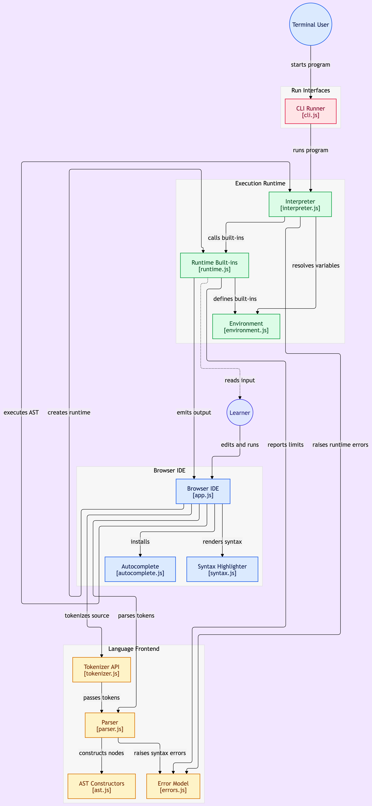

# Bhai Bhai Programming Language (Browser)

Bhai Bhai is a browser-based toy programming language and interpreter project built for learning compiler and runtime design in a practical, visual environment.

## Project overview

- The browser editor lives in [index.html](index.html), [style.css](style.css), and [app.js](app.js).
- The language implementation sits under [src](src).
- IDE tooling and editor experience are in [editor](editor).
- Project docs are in [docs](docs).

## Project architecture

The diagram below shows how the browser IDE, CLI runner, language frontend, runtime, and learner workflow fit together.



## Documentation

- [docs/PROJECT_DOCUMENTATION.md](docs/PROJECT_DOCUMENTATION.md) — full project architecture and implementation overview
- [docs/FEATURES.md](docs/FEATURES.md) — current and planned language features
- [docs/FUTURE_UPDATES.md](docs/FUTURE_UPDATES.md) — roadmap and update priorities
- [docs/TODO.md](docs/TODO.md) — active task list

## What the project does

The app tokenizes source text, parses it into an AST, runs the AST through an interpreter, and shows runtime output, tokens, and errors directly in the browser. It is designed as an educational prototype and a language playground rather than a production compiler.

## Run it

### Browser IDE

Open [index.html](index.html) in a browser, or serve the project with a local web server.

### CLI example

```bash
npm test
node src/cli.js examples/basic.bb
```

## Main components

- Tokenizer: [src/tokenizer_impl.js](src/tokenizer_impl.js)
- Parser: [src/parser.js](src/parser.js)
- AST constructors: [src/ast.js](src/ast.js)
- Interpreter: [src/interpreter.js](src/interpreter.js)
- Runtime built-ins: [src/runtime.js](src/runtime.js)
- Error model: [src/errors.js](src/errors.js)
- Browser IDE: [app.js](app.js)
- CLI runner: [src/cli.js](src/cli.js)

## Current status

This project is in a prototype stage with a working language core, browser IDE, and learning-oriented architecture. The main improvements completed here include CLI execution support, regression testing, documentation cleanup, and builtin identifier fixes.
